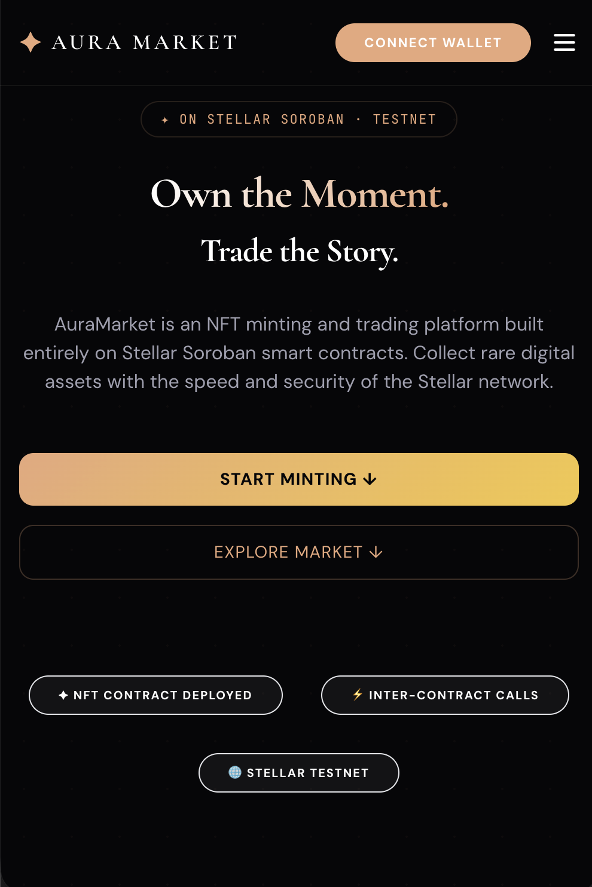

# ✦ AuraMarket

> NFT minting and peer-to-peer marketplace built on Stellar Soroban smart contracts.

[](https://github.com/viditsachan10-del/AuraMarket/actions)

## Live Demo
🔗 [aura-market-54vj.vercel.app](https://aura-market-54vj.vercel.app)

## What is AuraMarket?
AuraMarket is a high-fidelity NFT platform that brings the "Dark Luxury" aesthetic to the Stellar network. It allows creators to mint unique digital assets with rich metadata and trade them in a decentralized marketplace. Built entirely on Soroban, it leverages inter-contract communication to ensure secure and verified peer-to-peer trading.

## Features
- ✦ **Mint NFTs:** Single-transaction minting with automatic native registration to Freighter Collectibles.
- 🔄 **Inter-contract calls:** Marketplace verifies ownership and status via NFT contract
- 🛒 **Marketplace:** Peer-to-peer listing and purchasing using XLM
- 📊 **Real-time Activity:** Live protocol event feed polled directly from the blockchain
- 🔐 **Freighter Wallet:** Native Stellar authentication and transaction signing
- 📱 **Mobile Responsive:** Elegant "Dark Luxury" UI optimized for all devices

## Screenshots

### Desktop View


### Mobile Responsive View  


## Smart Contracts (Stellar Testnet)

| Contract | Address | Description |
|---|---|---|
| NFT Contract | `CCARXWBBRKC5UIO7DV6EUIJR2KVY3PK24KWXX2ARRJONTH5KCG3O6SEN` | SEP-41 compliant NFT minting, ownership, and metadata |
| Marketplace | `CB32CA4O4HWESWP72SANXNVQVMBQ3E5ZNDKYXHNCCBEXO5DHULKBMEMF` | Handles listing, buying, and fee distribution |

### Inter-Contract Calls
The Marketplace contract performs critical inter-contract operations with the NFT contract:
1. `list_nft` → calls `nft.get_nft()` to verify ownership before listing
2. `list_nft` → calls `nft.set_listed()` to prevent multiple listings
3. `buy_nft` → calls `nft.transfer()` to execute secure ownership change

**Deployment transaction hash (NFT):** `30caecab1bee9e3e8f74084c1cb71bf05d19a832a2b7eb4eb707f8df3e961764`

## Tech Stack
- **Frontend:** Next.js 14 (App Router), TypeScript, Tailwind CSS, SWR
- **Smart Contracts:** Rust, Soroban SDK 21.0.0
- **Wallet:** Freighter API (@stellar/freighter-api)
- **Network:** Stellar Testnet
- **CI/CD:** GitHub Actions → Vercel

## Local Development

Prerequisites: Node.js 20+, Rust, soroban-cli

```bash
# Clone
git clone https://github.com/viditsachan10-del/auramarket
cd auramarket

# Installation
npm install
cp .env.example .env.local
# Fill in contract addresses in .env.local
npm run dev

# Build contracts
cd contracts/nft
cargo build --target wasm32-unknown-unknown --release

cd ../marketplace  
cargo build --target wasm32-unknown-unknown --release
```

## Environment Variables
See `.env.example` for required variables.

## CI/CD
GitHub Actions runs on every push:
1. Builds both Rust contracts to WASM
2. Runs contract unit tests
3. Builds Next.js production bundle (with optimized asset checking)
4. Deploys to Vercel on merge to main

## License
MIT
